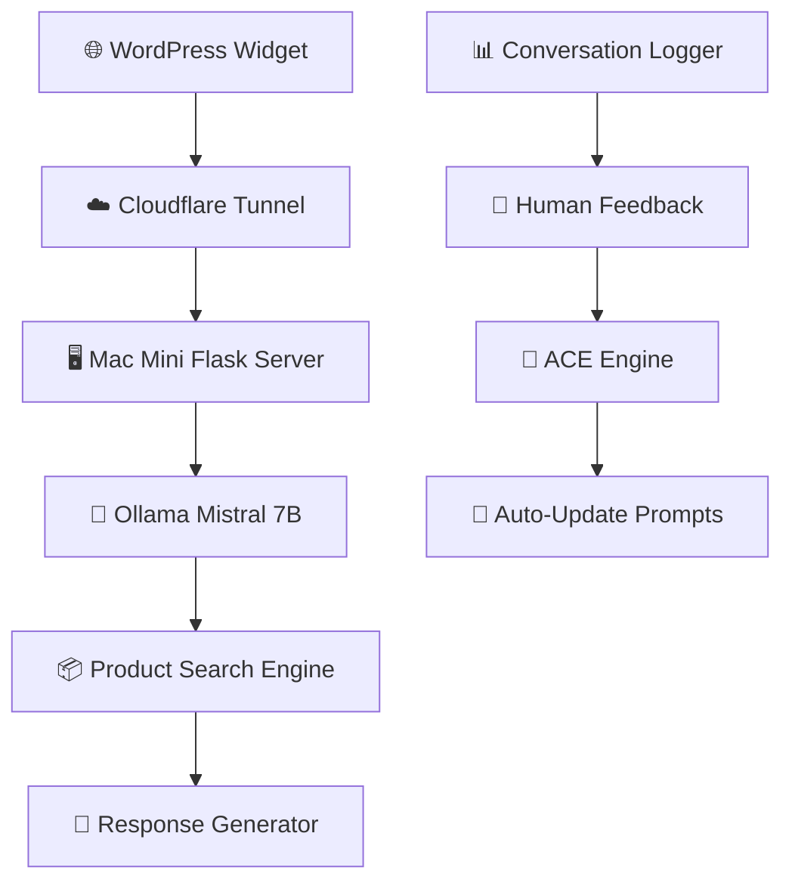

<div align="center">

# ✨ Divine Tribe AI Chatbot ✨

### 🚀 Mistral 7B with RLHF Self-Learning — Runs **locally** on Mac Mini


**🔥 Real-time Product Search • Troubleshooting • RLHF Learning System 🔥**  
Built for **Divine Tribe Vaporizers** • Works **24/7** • Self-improving AI  

---

## 🎉 **LIVE ON INEEDHEMP.COM** 🎉

[](https://ineedhemp.com)

</div>

---

<div align="center">

## 🌟 [🛒 Divine Tribe Vaporizers →](https://ineedhemp.com)  
*AI-Powered Customer Support for Hemp Vaporizers*

</div>

---

<div align="center">

## 🏆 Project Status & Performance

### 📱 **Platform & Compatibility**


### ⚡ **Performance & Features**


### 🛠️ **Technology Stack**


### 🔐 **Privacy & Deployment**


</div>

---

## ✨ Core Features

<table>
<tr>
<td width="50%">

### 🎯 **AI Customer Support**
- 🔍 **Smart Product Search** — 134 products with fuzzy matching
- 🛠️ **Troubleshooting Guide** — Lead wire checks, resistance testing
- 💬 **Natural Conversation** — Context-aware responses
- 🎁 **Discount Codes** — Auto-mentions `thankyou10` for 10% off

</td>
<td width="50%">

### ⚡ **Self-Learning System**
- 🧠 **RLHF** — Learn from human feedback
- 🔄 **ACE** — Auto-evolving prompts
- 📊 **Conversation Logging** — Track all interactions
- 📈 **Performance Improvement** — Gets smarter daily

</td>
</tr>
</table>

---

## ⚡ Performance Details

<div align="center">

**🏎️ Real-time Performance:** Average **2-3 second** response time

*Runs entirely on local Mac Mini M1 with 64GB RAM*

</div>

**🚀 Optimization Features:**
- Ollama framework with Mistral 7B
- Apple Silicon M1 optimization
- Smart product search with ranking
- Conversation history management

---

## 🛠️ Technology Stack

<div align="center">



</div>

| Component | Technology | Purpose |
|---|---|---|
| 🤖 **AI Model** | Mistral 7B (Ollama) | Natural language understanding |
| 🏗️ **Backend** | Flask + Python 3.13 | API server |
| ⚡ **Inference** | Ollama (Apple Silicon optimized) | Fast local LLM |
| 📊 **Database** | JSON (134 products) | Product catalog |
| 🎨 **Frontend** | Glassmorphism Widget | Beautiful UI |
| 🔋 **Deployment** | Cloudflare Tunnel | Public access |

---

## 📱 System Architecture

<div align="center">

### ✅ **Production Setup**

**Mac Mini M1 64GB RAM** → **Flask Server (port 5001)** → **Cloudflare Tunnel** → **Public URL**

**💡 Components:**
- `chatbot_modular.py` — Main Flask server
- `complete_products_full.json` — 134 product catalog
- `modules/` — Smart search, classification, response generation
- `conversation_logs/` — RLHF learning data

</div>

---

## 🔒 Privacy & Security

<div align="center">

### 🛡️ **Your Data Stays Local**

| Privacy Feature | Status | Description |
|---|---|---|
| 📊 **Customer Data** | 🔒 **LOCAL** | All conversations logged locally |
| 🌐 **Cloud Processing** | ❌ **NONE** | 100% on-premise AI |
| 📍 **Tracking** | ❌ **NEVER** | No analytics or telemetry |
| 🏢 **Third-Party APIs** | ❌ **NONE** | Self-hosted LLM |
| 🔐 **Data Encryption** | ✅ **macOS** | FileVault protection |

</div>

**🔐 Complete data sovereignty. Everything runs on your Mac Mini.**

---

## 📸 Live Screenshots

<div align="center">

### 🖼️ **See the Chatbot in Action**

| 🌐 **Widget** | 💬 **Chat Interface** | 🔍 **Product Search** | 🛠️ **Troubleshooting** |
| --- | --- | --- | --- |
|  |  |  |  |
| *Glassmorphism design* | *Real-time responses* | *134 products* | *Smart diagnostics* |

</div>

---

## 🚀 Getting Started

### 📋 **Requirements**
- **Hardware:** Mac Mini M1+ with 16GB+ RAM (64GB recommended)
- **Software:** macOS Sonoma+, Python 3.13, Ollama
- **Network:** Cloudflare Tunnel for public access

### ⚙️ **Quick Setup**
```bash
# 1. Clone the repository
git clone https://github.com/nicedreamzapp/divine-tribe-chatbot.git

# 2. Navigate to project
cd divine-tribe-chatbot

# 3. Set up virtual environment
python3 -m venv venv
source venv/bin/activate

# 4. Install dependencies
pip install flask flask-cors ollama

# 5. Install Ollama and pull Mistral
brew install ollama
ollama pull mistral

# 6. Run the chatbot
python3 chatbot_modular.py

# 7. In another terminal, start Cloudflare tunnel
cloudflared tunnel --url http://localhost:5001
```

### 🔑 **Configuration**
- 📦 **Product Catalog:** Edit `complete_products_full.json`
- 🎨 **Widget Design:** Update WordPress footer.php
- 🧠 **System Prompts:** Modify `modules/response_generator.py`

---

## 🔧 RLHF Learning System

<details>
<summary>🧠 <strong>How Self-Learning Works</strong> (Click to expand)</summary>

### 📚 **RLHF + ACE Architecture**

The chatbot improves itself through human feedback:

**1. Conversation Logging** (`conversation_logger.py`)
```bash
# Every customer interaction is logged to conversation_logs/
python3 chatbot_modular.py  # Automatically logs
```

**2. Human Feedback** (`feedback_interface.py`)
```bash
# Review conversations and mark good/bad
python3 feedback_interface.py

# Commands:
# [g] GOOD - Correct response
# [b] BAD - Explain what went wrong
# [s] SKIP - Review later
```

**3. Auto-Learning** (`ace_engine.py`)
```bash
# Generate new rules from feedback
python3 ace_engine.py --learn

# Output: Updates response_generator.py with learned rules
```

### 🎯 **Learning Cycle**
```
Customer chats → Logger saves → You review → Mark good/bad → 
ACE analyzes patterns → Generates rules → Updates prompts → 
Chatbot gets smarter → Repeat
```

### ⚡ **What It Learns**
- ❌ Stops hallucinating products
- ✅ Prioritizes complete kits over accessories
- 🎯 Mentions Cub only for Core owners
- 🔗 Uses exact product names and URLs
- 💡 Recognizes common troubleshooting patterns

</details>

---

## 🤝 Contributing

<div align="center">

### 🌟 **Private Repository** 🌟

This is a private project for Divine Tribe Vaporizers.

</div>

**📝 For internal development:**
- 📱 Test on multiple devices
- 🔄 Review conversation logs regularly
- 📋 Document product knowledge
- 📸 Update screenshots
- 🧪 A/B test different prompts

**🎯 Development priorities:**
- 🌍 Multi-language support
- 🎨 Widget customization options
- ⚡ Response time optimization
- 🐛 Edge case handling
- 📚 Knowledge base expansion

---

## 📞 Support & Contact

<div align="center">

### 💬 **Need Help?**

[](mailto:matt@ineedhemp.com)
[](https://ineedhemp.com)
[](https://discord.com/invite/aC4Pv6J75s)
[](https://www.reddit.com/r/DivineTribeVaporizers/)

</div>

---

## 📄 License & Credits

### ⚖️ **Private License**

- **🔒 Proprietary** — Divine Tribe Vaporizers internal use only
- **💼 Not for distribution** — Contact owner for licensing

### 🙏 **Acknowledgments**

| Component | Creator | License |
|---|---|---|
| 🤖 **Mistral 7B** | © Mistral AI | Apache 2.0 |
| 🦙 **Ollama** | © Ollama | MIT |
| 🍎 **Flask** | © Pallets | BSD-3-Clause |
| 🎨 **Chatbot Design** | © Divine Tribe | Proprietary |

---

<div align="center">

## 🌟 **Project Statistics** 🌟

[]()
[]()
[]()
[]()

### 🚀 **Made with ❤️ by Divine Tribe**

</div>

---

<div align="center">
<sub>© 2025 Divine Tribe AI Chatbot • Self-Hosted • Privacy-First • Self-Learning</sub>
</div>
