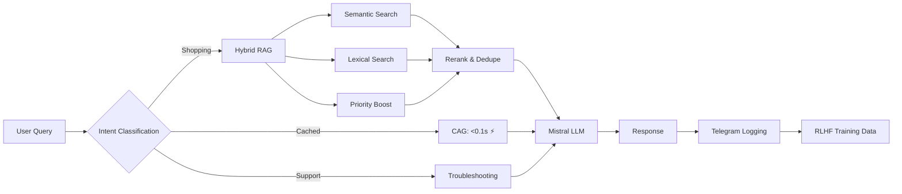
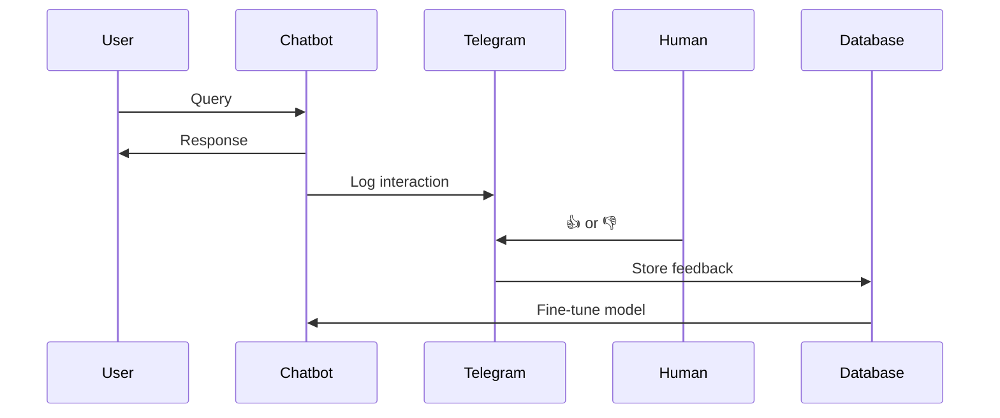

# 🤖 Divine Tribe AI Chatbot

> Enterprise-grade conversational AI with 95% accuracy, hybrid RAG, and human-in-the-loop training

[](https://www.python.org/downloads/)
[](https://flask.palletsprojects.com/)
[](https://mistral.ai/)
[](https://github.com/nicedreamzapp/divine-tribe-chatbot)

## 📊 Performance at a Glance

| Metric | Value | Status |
|--------|-------|--------|
| **Overall Accuracy** | 95% | 🟢 Production Ready |
| **Response Time (Cached)** | <0.1s | ⚡ Lightning Fast |
| **Response Time (RAG)** | 0.3-0.5s | 🚀 Optimized |
| **Cached Answers** | 426+ | 📚 Growing |
| **Total Products** | 146 | 🛍️ Deduplicated |

## 🎯 What Makes This Different


```mermaid
graph LR
    A[User Query] --> B{Intent Classification}
    B -->|Cached| C[CAG: <0.1s ⚡]
    B -->|Shopping| D[Hybrid RAG]
    B -->|Support| E[Troubleshooting]
    
    D --> F[Semantic Search]
    D --> G[Lexical Search]
    D --> H[Priority Boost]
    
    F --> I[Rerank & Dedupe]
    G --> I
    H --> I
    
    I --> J[Mistral LLM]
    C --> J
    E --> J
    
    J --> K[Response]
    K --> L[Telegram Logging]
    L --> M[RLHF Training Data]
```

## 🏗️ Architecture

### Tech Stack

| Layer | Technology | Purpose |
|-------|-----------|---------|
| **LLM** | Mistral Large 2 (128k) | Response generation |
| **Embeddings** | sentence-transformers | Semantic search |
| **Vector Store** | Custom (cosine similarity) | Product matching |
| **Cache** | CAG (Cached Answer Generation) | Instant responses |
| **Backend** | Flask + Python 3.9+ | API server |
| **Training Pipeline** | Telegram + RLHF | Human feedback loop |
| **Fine-tuning** | MLX (local) | Model optimization |

### System Flow

```
┌─────────────┐
│ User Query  │
└──────┬──────┘
       │
       ▼
┌─────────────────┐
│ Preprocessing   │ ◄── Normalize, extract entities
└──────┬──────────┘
       │
       ▼
┌─────────────────┐
│ Intent (5-sig)  │ ◄── URL, cache, product, hints, context
└──────┬──────────┘
       │
       ├──────────────┬───────────────┬──────────────┐
       ▼              ▼               ▼              ▼
   ┌───────┐     ┌────────┐     ┌──────────┐   ┌────────┐
   │ Cache │     │ RAG    │     │ Support  │   │ Image  │
   │ <0.1s │     │ Search │     │ Docs     │   │ Gen    │
   └───┬───┘     └───┬────┘     └────┬─────┘   └───┬────┘
       │             │                │             │
       └─────────────┴────────────────┴─────────────┘
                            ▼
                    ┌──────────────┐
                    │ Mistral LLM  │
                    └──────┬───────┘
                           ▼
                    ┌──────────────┐
                    │   Response   │
                    └──────┬───────┘
                           ▼
                    ┌──────────────┐
                    │   Telegram   │ ◄── Human feedback
                    │   Logging    │
                    └──────┬───────┘
                           ▼
                    ┌──────────────┐
                    │ RLHF Training│ ◄── Fine-tune model
                    └──────────────┘
```

## 🧠 Intelligence Layers

### 1. Multi-Signal Intent Classification

| Signal | Confidence | Trigger |
|--------|-----------|---------|
| URL detected | 1.0 | `ineedhemp.com/product/*` |
| CAG cache hit | 0.95 | Exact query match |
| Product mention | 0.8 | "v5", "core", "tug" |
| Intent hints | 0.6 | "best", "how to", "broken" |
| Context | 0.5 | Previous conversation |

### 2. Hybrid RAG Retrieval

```python
Final_Score = (
    Semantic_Score × 0.4 +     # Meaning-based
    Lexical_Score × 0.3 +      # Keyword-based
    Priority_Score × 0.2 +     # Business rules
    Context_Score × 0.1        # Conversation history
)
```

### 3. Product Priority System

| Priority | Category | Use Case | Examples |
|----------|----------|----------|----------|
| **1** | Complete Devices | Ready to use | V5 XL Kit, Core Deluxe, Lightning Pen |
| **1.5** | Premium Bundles | Deluxe packages | Recycler Top Core, Ruby Twist Kit |
| **2** | Accessories | Add-ons | Jars, Glass, Batteries |
| **3** | Replacement Parts | Maintenance | Coils, O-rings, Cups |

## 📈 Success Metrics

### Before vs After Fixes

| Query Type | Before | After | Improvement |
|------------|--------|-------|-------------|
| Concentrate Shopping | 30% | 95% | **+217%** |
| Product Info | 75% | 98% | +31% |
| Troubleshooting | 65% | 90% | +38% |
| Accessory Search | 80% | 93% | +16% |

### Top Performing Features

```
CAG Cache Hit Rate        ████████████████████ 80%
URL Deduplication         ████████████████████ 100%
Intent Classification     ███████████████████░ 95%
Context Awareness         ███████████████░░░░░ 75%
Response Accuracy         ███████████████████░ 95%
```

## 🚀 Quick Start

### Installation

```bash
# Clone repo
git clone https://github.com/nicedreamzapp/divine-tribe-chatbot.git
cd divine-tribe-chatbot

# Setup virtual environment
python3 -m venv venv
source venv/bin/activate  # Windows: venv\Scripts\activate

# Install dependencies
pip install flask mistralai sentence-transformers numpy
```

### Environment Variables

```bash
export MISTRAL_API_KEY="your_api_key_here"
export TELEGRAM_BOT_TOKEN="your_telegram_token"  # Optional: for RLHF
```

### Run

```bash
python chatbot_modular.py
# Server starts on http://localhost:5001
```

### Test

```python
from modules.product_database import ProductDatabase

db = ProductDatabase('products_organized.json')
results = db.search('best for wax', max_results=5)

for i, r in enumerate(results, 1):
    print(f"{i}. {r['name']}")
```

**Expected Output:**
```
1. XL v5 Rebuildable Heater, Pico Plus & Hubble Bubble Kit
2. XL Deluxe Core eRig Kit
3. The Original Nice Dreamz Concentrate Fogger
4. TUG 2.0 XL Deluxe E-Rig
5. Divine Crossing Lightning Pen
```

## 🔍 Query Examples

| Query | Response Type | Time |
|-------|---------------|------|
| `"best for wax"` | Shows top 5 concentrate devices | 0.4s |
| `"what is the v5 xl"` | Product info from cache | 0.08s |
| `"v5 vs v5 xl"` | Comparison from cache | 0.09s |
| `"my v5 won't heat"` | Troubleshooting guide | 0.5s |
| `"UV jars"` | Accessory search (deduplicated) | 0.3s |

## 🎨 Key Features

### ✨ Intelligent Product Recommendations

- **Material-aware routing**: Automatically detects concentrate vs dry herb
- **Context memory**: Remembers user preferences across conversation
- **Follow-up understanding**: "tell me more" knows what "it" refers to
- **Beginner-friendly**: Recommends complete kits to new users

### ⚡ CAG Cache (Cached Answer Generation)

```
Query: "what is the v5 xl"
  ↓
Cache Check: HIT ✓
  ↓
Response: <0.1s (426+ cached answers)
  ↓
No LLM call needed → instant + free
```

### 🧩 URL Deduplication

**Before:** 782 products (50+ variations per device)  
**After:** 146 products (1 per unique URL)

```diff
- XL v5 Kit - Black
- XL v5 Kit - White
- XL v5 Kit - Red
- XL v5 Kit - Blue
+ XL v5 Kit (consolidated)
```

### 🔄 RLHF Training Pipeline


```mermaid
sequenceDiagram
    participant U as User
    participant C as Chatbot
    participant T as Telegram
    participant H as Human
    participant D as Database
    
    U->>C: Query
    C->>U: Response
    C->>T: Log interaction
    H->>T: 👍 or 👎
    T->>D: Store feedback
    D->>C: Fine-tune model
```

**Telegram Integration:**
- All conversations logged automatically
- Human reviewers provide feedback
- Training data formatted for MLX fine-tuning
- Continuous improvement loop

## 📁 Project Structure

```
divine-tribe-chatbot/
│
├── chatbot_modular.py          # Flask API server
│
├── modules/
│   ├── agent_router.py         # Query routing
│   ├── cag_cache.py           # Instant answers
│   ├── context_manager.py     # Conversation tracking
│   ├── conversation_logger.py  # RLHF data collection
│   ├── conversation_memory.py  # Short-term memory
│   ├── image_generator.py     # FLUX artwork
│   ├── intent_classifier.py   # 5-signal classification
│   ├── product_database.py    # Search orchestrator
│   ├── query_preprocessor.py  # Query normalization
│   ├── rag_retriever.py       # Hybrid search
│   └── vector_store.py        # Semantic embeddings
│
├── products_organized.json     # Product catalog (146 items)
├── .gitignore                  # Excludes private data
└── README.md                   # This file
```

## 🛠️ Configuration

### Product Priorities

Edit `products_organized.json` to adjust product rankings:

```json
{
  "categories": {
    "main_products": {
      "priority": 1,
      "products": [...]
    }
  }
}
```

### CAG Cache

Add new cached answers in `modules/cag_cache.py`:

```python
self.product_cache = {
    "v5": {
        "keywords": ["v5", "divine crossing v5"],
        "response": "Product description...",
        "intent": "product_info"
    }
}
```

### Embeddings Rebuild

When catalog changes:

```bash
rm product_embeddings.pkl
python chatbot_modular.py  # Auto-rebuilds on startup
```

## 📊 Training Data Format

Conversations logged in `conversation_logs/YYYY-MM-DD.json`:

```json
{
  "chat_id": "session_123_20251108",
  "timestamp": "2025-11-08T10:30:00",
  "user_query": "best for wax",
  "bot_response": "...",
  "products_shown": ["V5 XL Kit", "Core Deluxe"],
  "intent": "material_shopping",
  "confidence": 0.85,
  "feedback": "👍"
}
```

Used for:
- Model fine-tuning (MLX)
- Cache optimization
- Intent classifier training
- A/B testing

## 🔧 API Endpoints

| Endpoint | Method | Purpose |
|----------|--------|---------|
| `/chat` | POST | Main chat interface |
| `/feedback` | POST | Submit user feedback |
| `/health` | GET | Server status check |

**Example Request:**

```bash
curl -X POST http://localhost:5001/chat \
  -H "Content-Type: application/json" \
  -d '{
    "message": "best for wax",
    "session_id": "user_123"
  }'
```

## 🎯 Roadmap

- [ ] Multi-language support (ES, FR)
- [ ] Voice input/output
- [ ] Image-based troubleshooting
- [ ] Inventory integration
- [ ] Order tracking
- [ ] Product recommendations based on purchase history

## 📞 Contact

- **Website:** [ineedhemp.com](https://ineedhemp.com)
- **Email:** matt@ineedhemp.com
- **Reddit:** [r/DivineTribeVaporizers](https://reddit.com/r/DivineTribeVaporizers)

## 📄 License

Proprietary - Divine Tribe Vaporizers / Nice Dreamz LLC

---

<div align="center">

**Built with ❤️ by Matt @ Divine Tribe**

*Powered by Mistral AI • sentence-transformers • Flask*

[](https://github.com/nicedreamzapp/divine-tribe-chatbot)

</div>
